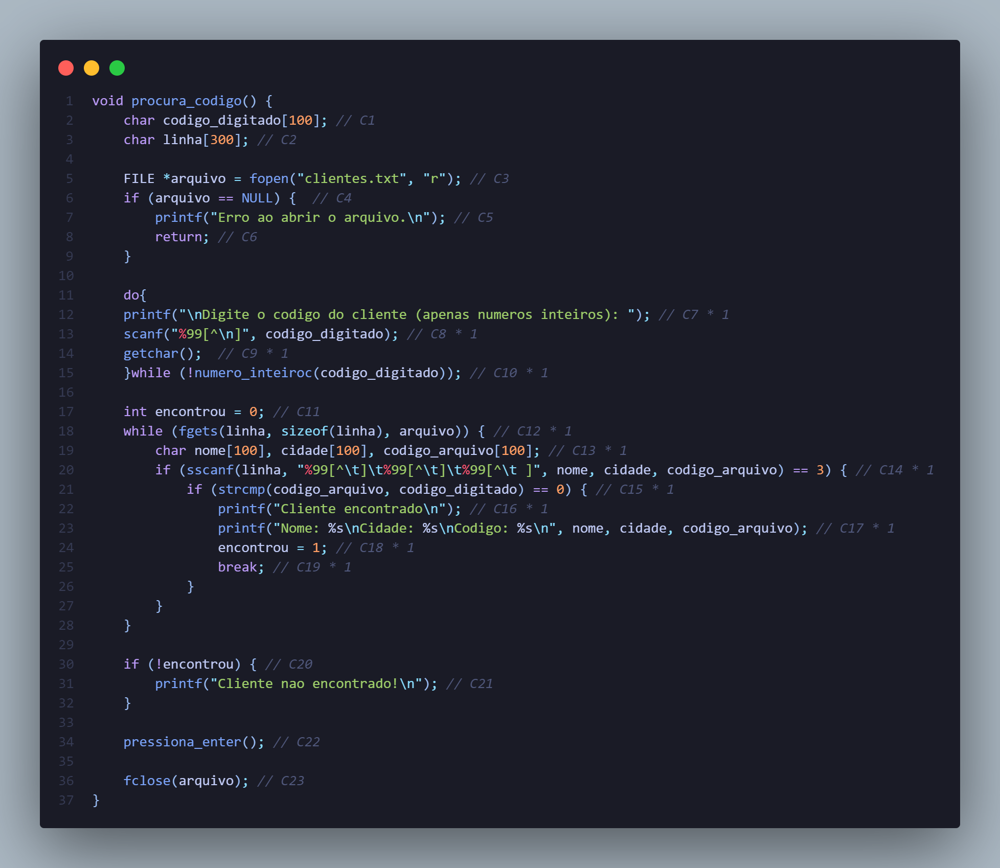
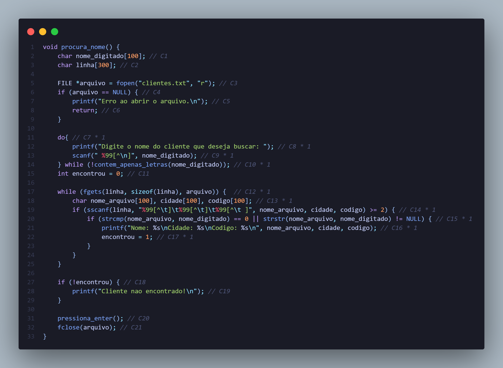
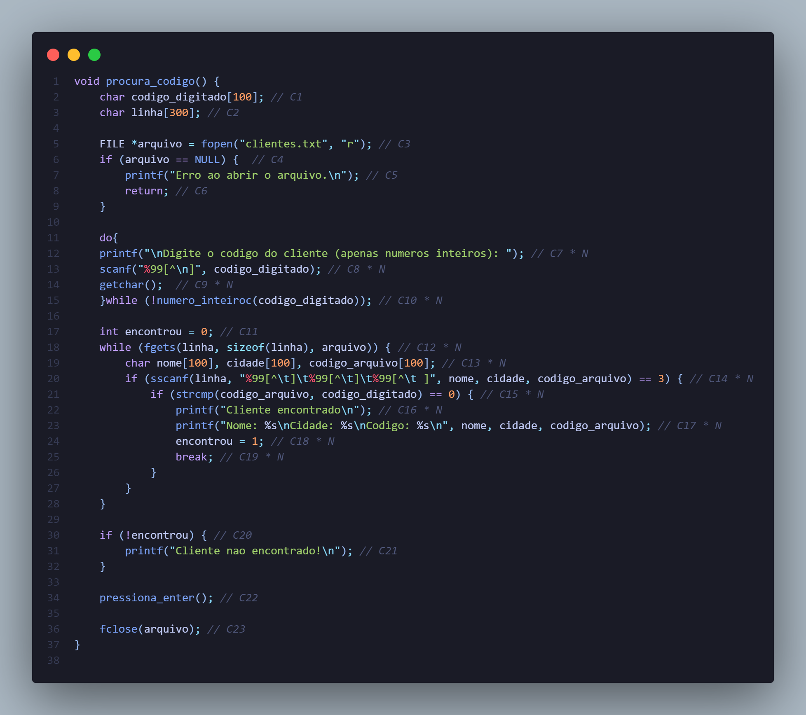
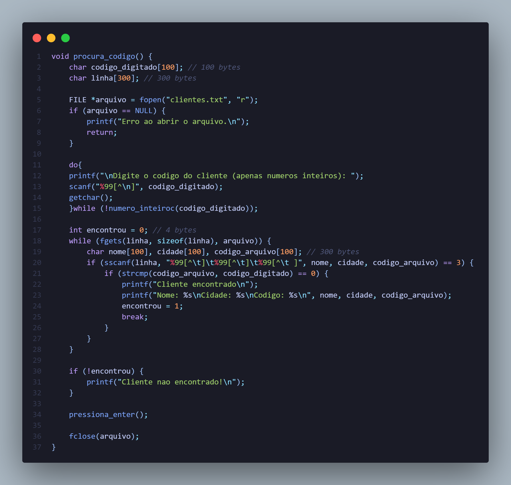
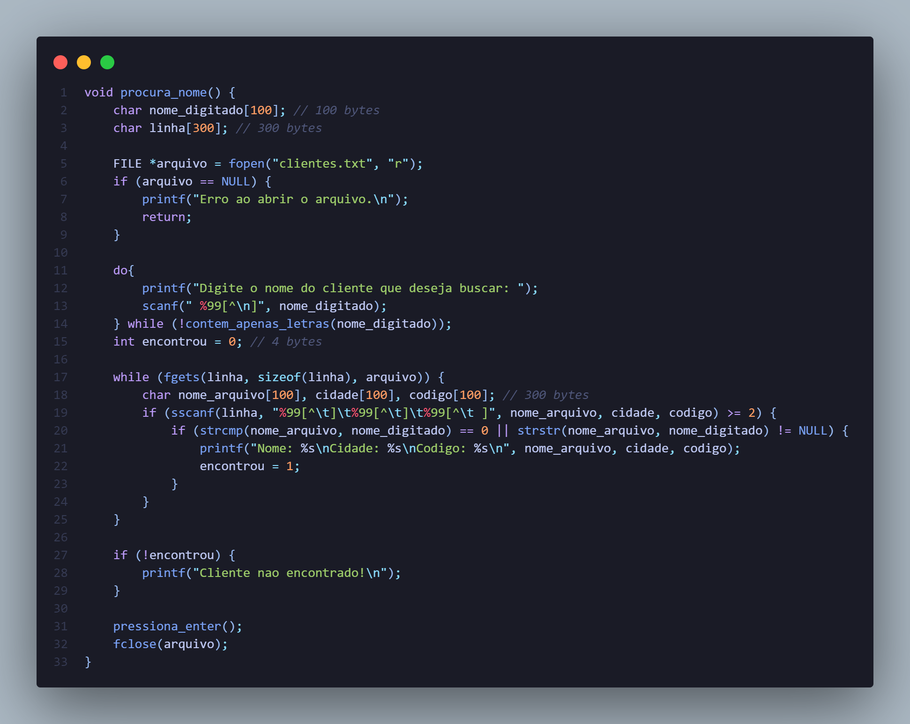

# Busca Sequencial de Clientes (C)

Esta pasta abriga o projeto de busca de clientes utilizando o algoritmo de busca sequencial em C. Neste arquivo você verá:

- Pré-Requisitos;
- Organização do repositório;
- Busca Sequencial na linguagem C;
- Execução do projeto;
- Análise de complexidade;
- Referências;

## 1. Pré-Requisitos:

Certifique-se de que você possui um compilador C instalado. Recomendamos o uso do [GCC](https://gcc.gnu.org/) para compilar o código.

## 2. Organização do repositório:

A organização desta parte está disposta da seguinte forma:

``` 
📁 - BuscaSequencialClientes
│
└───linguagem_c
        │
        ├──cliente.c
        ├──clientes.h
        ├──main.c
        └── README.md
```
## 3. Busca Sequencial na linguagem C:

A implementação da **Busca Sequencial** deste projeto é dada no arquivo `cliente.c` de forma que é aplicada em duas funções para diferentes termos. Dessa forma, para cada linha do arquivo `clientes.txt` é criado um vetor das palavras dela. Assim, é feita uma comparação para verificar se o termo buscado se encontra na linha. Caso encontre, será impresso o resultado, se não, será impresso `Cliente não encontrado!`

As funções de busca são:

- `procura_nome`: Procura um cliente pelo nome no arquivo clientes.txt;
```
void procura_nome() {
    char nome_digitado[100];
    char linha[300];

    FILE *arquivo = fopen("clientes.txt", "r");
    if (arquivo == NULL) {
        printf("Erro ao abrir o arquivo.\n");
        return;
    }

    do{
        printf("Digite o nome do cliente que deseja buscar: ");
        scanf(" %99[^\n]", nome_digitado);
    } while (!contem_apenas_letras(nome_digitado));
    int encontrou = 0;

    while (fgets(linha, sizeof(linha), arquivo)) {
        char nome_arquivo[100], cidade[100], codigo[100];
        if (sscanf(linha, "%99[^\t]\t%99[^\t]\t%99[^\t ]", nome_arquivo, cidade, codigo) >= 2) {
            if (strcmp(nome_arquivo, nome_digitado) == 0 || strstr(nome_arquivo, nome_digitado) != NULL) {
                printf("Nome: %s\nCidade: %s\nCodigo: %s\n", nome_arquivo, cidade, codigo);
                encontrou = 1;
            }
        }
    }

    if (!encontrou) {
        printf("Cliente nao encontrado!\n");
    }

    pressiona_enter();
    fclose(arquivo);
}

``` 
###### Trecho do código em que ocorre a busca sequencial na função procura_nome

- `procura_codigo`: Procura um cliente pelo código no arquivo clientes.txt.
```
   void procura_codigo() {
    char codigo_digitado[100];
    char linha[300];

    FILE *arquivo = fopen("clientes.txt", "r");
    if (arquivo == NULL) {
        printf("Erro ao abrir o arquivo.\n");
        return;
    }

    do{
    printf("\nDigite o codigo do cliente (apenas numeros inteiros): ");
    scanf("%99[^\n]", codigo_digitado);
    getchar();
    }while (!numero_inteiroc(codigo_digitado));
  
    int encontrou = 0;
    while (fgets(linha, sizeof(linha), arquivo)) {
        char nome[100], cidade[100], codigo_arquivo[100];
        if (sscanf(linha, "%99[^\t]\t%99[^\t]\t%99[^\t ]", nome, cidade, codigo_arquivo) == 3) {
            if (strcmp(codigo_arquivo, codigo_digitado) == 0) {
                printf("Cliente encontrado\n");
                printf("Nome: %s\nCidade: %s\nCodigo: %s\n", nome, cidade, codigo_arquivo);
                encontrou = 1; //cliente encontrado
                break;
            }
        }
    }

    if (!encontrou) {
        printf("Cliente nao encontrado!\n");
    }

    pressiona_enter();

    fclose(arquivo);
}
``` 
###### Trecho em que ocorre a busca sequencial na função procura_codigo

## 4. Execução do projeto:
Para uma boa execução do projeto, garanta-se de, no **terminal** está no caminho da pasta `linguagem_c`. Além disso, há uma diferença de execução para os diferentes tipos de sistema operacional. 

- Windows: Não é necessário mudar o código original, a constante de sistema operacional já está correta.

```strcpy(sistema_operacional, "cls");```
###### Linha 204 do arquivo cliente.c

- Linux: É necessário a mudança da no `strcpy` presente na linha 204 do arquivo cliente.c. Garanta-se de salvar a mudança.

```strcpy(sistema_operacional, "clear");```
###### Linha 204 do arquivo cliente.py

### 4.1 Compilação do código:
Para compilar o código, abra o terminal e navegue até a pasta `linguagem_c` e execute o seguinte comando:
```
gcc -c cliente.c 
```
Seguido do 
```
gcc -c main.c
```
E por fim, para executar o código, digite o comando:
```
gcc -o main cliente.o main.o
```
**Observação:** O  "main" é o nome do arquivo executável que será gerado após a compilação, você pode escolher o nome que desejar.

### 4.2 Execução do código:
Para executar o código, digite o comando:
```
./main
```

## 5. Análise de complexidade Temporal:
### 5.1 Melhor caso 
O melhor caso ocorre quando o elemento buscado é o primeiro elemento do vetor. Neste caso, a complexidade é constante, ou seja, O(1).

- Procura_codigo:

*cálculos:*    

T(N)= C1+ C2 + C3 + C4 + C5 + C6 + C7 * 1 + C8 * 1 + C9 * 1 + C10 * 1 + C11 + C12 * 1 + C13 * 1 + C14 * 1 + C15 * 1 + C16 * 1 + C17 * 1 + C18 * 1 + C19 * 1 + C20 + C21 + C22 + C23

T(N) =(C1 + C2 + C3 + C4 + C5 + C6 + C20 + C21 + C22 + C23) + (C7 + C8 + C9 + C10 + C11 + C12 + C13 + C14 + C15 + C16 + C17 + C18 + C19) * 1

T(N) = a + b * 1

*Colocando na notação Big(O):* b * 1 = 1 = bigO(1)

- Procura_nome:



*cálculos:*

T(N) = C1 + C2 + C3 + C4 + C5 + C6 + C7 * 1 + C8 * 1 + C9 * 1 + C10 * 1 + C11 + C12 * 1 + C13 * 1 + C14 * 1 + C15 * 1 + C16 * 1 + C17 * 1 + C18 * 1 + C19 * 1 + C20 + C21 + C22 + C23

T(N) = (C1 + C2 + C3 + C4 + C5 + C6 + C20 + C21 + C22 + C23) + (C7 + C8 + C9 + C10 + C11 + C12 + C13 + C14 + C15 + C16 + C17 + C18 + C19) * 1

T(N) = a + b * 1

*Colocando na notação Big(O):* b * 1 = 1 = bigO(1)

### 5.2 Pior caso
O pior caso ocorre quando o elemento buscado é o último elemento do vetor. Neste caso, a complexidade é linear, ou seja, O(n).

- Procura_codigo:

 
*cálculos:*   
T(N) = C1 + C2 + C3 + C4 + C5 + C6 + C7 * N+ C8 * N + C9 * N + C10 * N + C11  * N + C12 + C13 * N + C14 * N + C15 * N + C16 + C17 + C18 + C19   
T(N) = (C1 + C2 + C3 + C4 + C5 + C6 + C7 + C16 + C17 + C18 + C19) + (C7 + C8 + C9+ C10 + C11 + C13 + C14 + C15) * N   
T(N) = a + b * N   
*Colocando na notação Big(O):* b * N = N = bigO(n)

- Procura_nome:


*cálculos:*
T(N) = C1 + C2 + C3 + C4 + C5 + C6 + C7 * N+ C8 * N + C9 * N + C10 * N + C11  * N + C12 + C13 * N + C14 * N + C15 * N + C16 + C17 + C18 + C19 + C20 + C21 + C22 + C23

T(N) = (C1 + C2 + C3 + C4 + C5 + C6 + C7 + C16 + C17 + C18 + C19 + C20 + C21 + C22 + C23) + (C7 + C8 + C9+ C10 + C11 + C13 + C14 + C15) * N

T(N) = a + b * N

*Colocando na notação Big(O):* b * N = N = bigO(n)

# 6. Análise de complexidade Espacial:

A complexidade espacial do algoritmo de busca sequencial é O(1), uma vez que não irá mudar independente da entrada do algoritmo.

- Procura_codigo:
    

    S(P) = c + Sp
    Como todas as variáveis são constantes, Sp = 0; 
    S(P) = (100 + 300 + 4 + 300) 
    S(P) = 704
    Assim, a função procura_codigo ocupa 704 bytes.

- Procura_nome:
    
    S(P) = c + Sp

    Como todas as variáveis são constantes, Sp = 0; 

    S(P) = (100 + 300 + 4 + 300) 

    S(P) = 704 bytes

    Dessa forma, a função procura_nome ocupa 704 bytes de memória.


## Referências utilizadas: 
- [OPERAÇÃO DE BUSCA SEQUENCIAL.](https://www.cin.ufpe.br/~garme/public/(ebook)Estruturas%20de%20Dados%20Usando%20C%20(Tenenbaum).pdf.)
